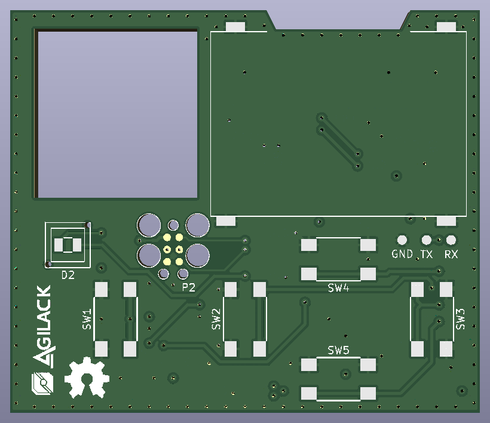

CowDIN ESP-UI
=============

This project is an electronic module to add a user interface (display +
buttons) as frontend of a DIN enclosure (3U). It can be used for example
with the cowdin ESP32 communication module (see cowdin-3b-esp32)

<table>
<tr>
<td></td>
<td></td>
</tr><tr>
<td>Fig1: Kicad 3D preview (top)</td>
<td>Fig2: Kicad 3D preview (bottom)</td>
</tr>
</table>

License
-------

This project is OpenHardware. Hardware design and materials are published
under terms of the Creative Commons ShareAlike license (CC-by-SA) see
hardware/License.md.
